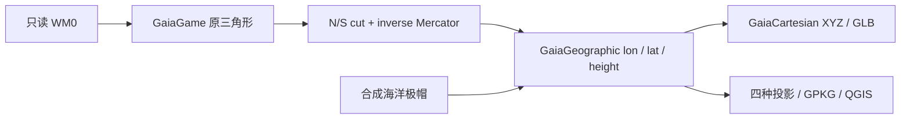

# Reconstruction and evidence boundaries

V1 Geometric Gaia is the canonical **GaiaGIS** reconstruction. It is a mathematical
interpretation, not official/canonical FINAL FANTASY VII geography. v2.0 integrates
the application; it does not revise reconstruction, topology or game semantics.

## Evidence classes

**Observed:** source bytes/hashes, MAP triangles/attributes, source lineage and
periodic boundary matches. WM0 has 142,586 base triangles over 294,912 × 229,376
raw horizontal units. Both raw boundary cycles close geometrically.

**Derived:** topology analysis, circular geography statistics, V1 parameterization,
source-to-Web transport, verified-entrance navigation and static graph results.
Derivation retains map/section/mesh/triangle and source hashes.

**Reconstructed/Assumed:** inverse-Mercator latitude with source limits about
±80.071528814895°, an N/S cut, 9,792 synthetic ocean-cap triangles, reference sphere
radius 6,371,008.8m and 1m/raw-height scale. E/W longitude remains periodic. Radius,
orientation, poles, prime meridian and physical heights are not FF7 canon.

**Reference-derived:** classic-PC encounter/traversal/model behavior independently
implemented from documented/decompiled semantics. Reference-only material is not
copied as a runtime implementation. Third-party license boundaries are retained.

**Unknown:** current Steam 2026 executable runtime equivalence; story/save/model
availability; exact moving-object current positions; unresolved event anchors;
WM2/WM3 global transforms, vertical datums and physical integration. They remain
visible limitations rather than invented values.

## Spatial domains

WM0 source topology is toroidal. V1 cuts the raw N/S cycle in the validated ocean
band and closes the reconstructed sphere with synthetic caps. It does not make
the raw game map a pre-existing latitude/longitude dataset. Physical measurement
and route distance use the assumed sphere. Gameplay terrain is not ecological
land cover, encounter weights are not absolute probabilities, and compatible
terrain is not global runtime reachability.

WM2 Underwater and WM3 Great Glacier remain native raw-coordinate domains with
independent geometry and textures. They are not bathymetry/polar layers of WM0.
Transition evidence can open a target map without establishing a global mapping.
No geographic coordinates are fabricated for these maps.

Stage 1 Float64 GIS is the coordinate authority; Web transport is Float32. The
previously measured maximum sphere-coordinate quantization error is about 0.424m.
Explorer v2 recovers WM0 raw integer corners through the frozen inverse mapping
and verifies them against v1; it changes storage ownership, not movement rules.
Its integer recovery is not a new high-precision GIS conversion.

Climate V2/V2.1/V2.2 concluded **Experimental / Inconclusive** and did not establish
a robust replacement latitude mapping. No climate warp is selectable in the
formal Viewer. Historical work is retained, not executed or extended in v2.0.

Detailed foundations remain in [Stage 0](../development/testing.md),
[V1 sphere](reconstruction.md), [routing](routing.md),
[native coordinate spaces](coordinate-spaces.md) and
[Explorer movement](../user/explorer.md). See [data and copyright](data-policy.md)
for the separate publication status of game-derived material.

## Spatial analysis and locomotion (v2.5)

Analysis borrows the loaded WM0 mesh and existing routing/encounter owners.
Route sampling follows the solved source-face corridor through face centers and
verified shared-edge midpoints, including the periodic E/W seam. Height is direct
TIN interpolation in raw game units; configured display elevation uses 1 m/raw.
Horizontal segment distance uses great circles on the unchanged V1 reference
sphere. The summed sampled corridor may exceed the graph's centroid-edge cost;
both are disclosed. Synthetic caps, visual relief and route-line clearance are
excluded. Terrain and static encounter sets aggregate the same segment lengths,
not face counts. Encounter exposure never simulates RNG, battles or save state.

For source-plane height h = aX + bZ + c, configured slope is
atan(hypot(a,b)) with horizontal/vertical scale ratio 1/1. Inverse Mercator is
nonuniform, so this is source-space slope, not physical reference-sphere slope.
North is −Z and east +X; downslope aspect is atan2(−a,b), wrapped to 0–360°.
Flat gradients below 1e-8 have undefined aspect; degenerate horizontal faces have
undefined slope/aspect. Surface values are computed once per mesh and remain
invariant under all thirteen display projections and comparison.

Service Area applies bounded Dijkstra to the existing routing CSR and weights,
using its cached movement eligibility and conditional policy. Thresholds are
reference-sphere path metres, not travel time. Highlighted whole source faces
represent reachable graph-node centers, not a continuous distance boundary.
No second graph, raster buffer, geographic transform or source pack is created.

Extended locomotion is selected only for exact own-HRC/bone/clip bindings reviewed
against field-loader context and posed source cycles. Preview cadence normalizes
the fast cycle to about 2 Hz (Yuffie 14/15 playback rate); movement displacement
remains the existing Foot owner. Cached display offsets prevent negative posed
floor penetration without changing source bones/root frames or original airborne
phases. Residual sliding is documented; original Steam runtime timing remains
unverified. See the [v2.5 methods and validation](../development/testing.md).

## Gaia Atlas (v2.2)

Atlas adds offline authored place knowledge, secrets and collectible/reward discovery to Explore search. Search names, aliases, categories, regions and item names; one-edit spelling fallback follows literal matches. The shared Inspector shows localized overview, type/region, access, gameplay, discoveries, related places, precision/evidence and reviewed sources. Sources are external links opened only when requested. The default spoiler setting hides major story rewards, including their search aliases; select Show all deliberately to reveal them.

Layers has Places, Secrets and Collectibles switches. Collectibles marks verified parent-place entrances only, never a chest or interior reward position. An entrance-level card enables existing route, measurement and Explorer actions. Parent-place/field-only cards offer Fly to parent place; unresolved records have no map point. Gold Saucer, Northern Cave, Ancient Forest and Sunken Gelnika retain searchable knowledge without guessed global placement. Native WM2/WM3 positions are never treated as geographic coordinates.

The local launcher generates the optional ignored `gaia-atlas.json` through the existing workspace builder, with curated-content, POI, source, transition and generator fingerprints. Warm reuse remains offline. Old workspaces without Atlas retain bundled knowledge with currently validated POI bindings. Public source-only pages can search/read knowledge without a spatial pack. No save-state, treasure-collected state, battle or field renderer is included.

See [research](architecture.md), [schema](atlas.md), [spatial evidence](atlas.md) and [local validation](../development/testing.md). Source-only distribution remains mandatory; all generated packs and screenshots stay ignored.

## Gaia 球面重建

WM0 base geometry → 解析参数化 → Gaia Geographic → Cartesian sphere 和 GIS 投影。没有气候拟合或优化求解；Stage 0 报告及输出保留。

### 公式与约定

WM0 extent **Observed**：W=294912、H=229376 raw units；代码从 parser extent 取得。`game_east=mesh_offset_east+raw_x`、`game_north=mesh_offset_north+raw_z`、`game_height=raw_y`。不使用 rendering scale。

默认 x=game_east，n=game_north：

$$R_{raw}=\frac{W}{2\pi},\quad \lambda=2\pi(\frac{x}{W}-\frac12),\quad v=\frac H2-n,\quad \phi=\arctan(\sinh\frac{v}{R_{raw}}).$$

等价纬度公式 `2 atan(exp(v/Rraw))−π/2`。反算 `n=H/2−Rraw asinh(tan φ)`、`x=W(λ/(2π)+1/2)`，均有自动测试。实际 **φmax=80.071528814895°**；赤道 n=114688。默认小 n 对应北，flip_latitude 可反转。

这是 **Reconstructed** analytic inverse Mercator，水平二维参数化保形；不声称 FF7 官方使用 Mercator。原 soup 有重叠/竖直面，变换后仍是连接变换顶点的平面三角片，面内并非解析球面。

默认 x=0→−180°、W/2→0°、W→+180°。game seam 作为 cartographic antimeridian，没有 lore prime meridian 声明；antimeridian_game_east 可平移 cut。N/S 两侧不再识别，E/W 保持周期。

默认 **Assumed** 球半径 R=6371008.8m，a=b=R，不是 WGS84 ellipsoid。默认 `h=game_height×1m/raw unit` 也是 **Assumed**；flatten 时 h=0、raw 不变。没有物理 vertical datum。

$$X=(R+h)\cos\phi\cos\lambda,\quad Y=(R+h)\cos\phi\sin\lambda,\quad Z=(R+h)\sin\phi.$$

GeoPackage Z 是假定 radial height，水平 CRS 不冒充垂直 CRS。GLB 使用 glTF Y-up：`(glbX,glbY,glbZ)=(GaiaX,GaiaZ,−GaiaY)`，单位米。GLB Float32 在地球尺度有亚米量化误差，GPKG Float64 为坐标依据。source triangle indices/order/winding 保留；radial normals 仅用于验证着色，原 normals/UV 在 sidecar。

### 极帽与反经线

每条 N/S boundary 有 288 个唯一 longitude samples。ring0 是原边界，默认每帽增加 8 条等纬圈和一个 pole：

- 每帽新增 2305 顶点、4896 三角形；两帽 **4610 新顶点、9792 三角形**。
- 独立 cap mesh 还存储 288 个 boundary samples，两帽共 **5186 cap vertex records**，不要全称为新增唯一顶点。
- 纬度为 `φboundary+j/(ring_count+1)×(φpole−φboundary)`，合成高度为零。
- geometry_origin=synthetic_polar_cap，synthetic_feature=north_polar_ocean/south_polar_ocean，synthetic_surface_class=ocean。FF7 source/map/section/mesh/triangle/terrain/region/script/texture 全 NULL。
- PointZ/sidecar 保留 longitude、latitude、height、hemisphere、ring index 和真实 boundary source refs，可再生。GLB 每帽一个 pole；GIS pole longitude 使用 sector 中央值，避免无意义的大跨度边。

Geographic polygon 先按短边展开经度，再按 ±180° windows 裁剪、插值 Z；part_id 保留原 triangle lineage。测试 179°/−179° 小三角形分成两片，面积与 seam Z 一致，不横跨 358°。默认 FF7 已在 seam 分 mesh；平移 longitude cut 时同一算法实际切分原 triangles。

### GIS、投影与工程

自定义 Gaia datum/sphere/cartographic-origin 存 WKT2/PROJ，无伪造 EPSG。GDAL GeoPackage 保留 WKT2 definition_12_063。raw 是 engineering CRS/raw game units，不是经纬度或物理米。

| 产品 | 规则 |
|---|---|
| gaia_raw.gpkg | raw PolygonZ `(game_east,game_north,game_height)` |
| gaia_geographic.gpkg | combined、FF7、polar PolygonZ；另有 cap PointZ |
| Equirectangular / Plate Carrée | `+proj=eqc +lat_ts=0 +lon_0=0 +R=6371008.8` |
| Mercator | `+proj=merc +lat_ts=0 +R=6371008.8`；裁至 ±85.0511287798066°，可配置 |
| Mollweide | `+proj=moll +lon_0=0 +R=6371008.8`；完整面，pole 有限 |
| Orthographic | `+proj=ortho +lon_0=0 +lat_0=0 +R=6371008.8`；正面半球，中心可配置 |

所有投影由 Geographic 经 PROJ 转换，Z 保留 radial height。Mercator 裁 cap polygons；Orthographic 使用法向点积 visibility、沿 lon/lat polygon 边二分求 horizon。分类与交点搜索使用一致容差，pole 判为边界。输出逐点检查有限值，clipped/omitted 数量写 metadata。边是 lon/lat linear interpolation，尚无 geodesic densification；被裁面仍在 Geographic/GLB 中。

QGIS 工程有 Geographic、四种投影、raw 分组与 FF7 gameplay terrain colors，合成 ocean 为独立类别。默认 Geographic canvas，5 个 CRS-aware bookmarks；自动重开保存的 QGZ、验证图层和渲染 5 张 PNG。workspace 独立 profile 不改变用户正常 QGIS profile。

### 验证、安全与限制

原 source triangles 不焊接、不删除、不改索引；alternative sections 不进入默认 base surface。诊断只用 exact position keys 识别 E/W seam，保留两条 N/S boundary 再分别接帽，不改变 export tables。

新 cap/attachment 要无开放边，但保留原 soup 重叠、重复面和内部缺口，不宣称全局 manifold。topology.json 记录 incidence 与 source_repairs_performed=0。

参数、源 SHA、extents、runtime、projection policy、counts、路径在 output/reconstruction/build_metadata.json。测试结果在 tests.json/tests.log：数学往返、flip/flatten、radius、seam split、horizon、真实 cap attachment、GPKG lineage/CRS、原 GLB indices/量化精度、全部坐标有限性和 QGZ reopen。Stage 0 输出未覆盖。

**FF7 source modified: NO**。WM0/WM2/WM3/world_us.lgp 和 BOT 构建前后 size/SHA 比较在 metadata；Stage 0 fingerprint 保留。所有项目文件/profile/cache/temp/output 在 the GaiaGIS workspace。

未决工程问题：原 soup 的 6 条内部开放边和重叠面需未来另建可追溯 repair policy；近距离 globe 需局部 origin/分块改善 Float32 精度；纹理与真实 normals 着色未实现；高度比例无物理标定。这些不改变本阶段参数化结果。

### API 与规范依据

数学/caps/GLB 为自有实现，格式层复用 Stage 0 自有 parser。GIS 使用已安装 GDAL/PROJ/PyQGIS。

- [PROJ Mercator](https://proj.org/en/stable/operations/projections/merc.html)、[Mollweide](https://proj.org/en/stable/operations/projections/moll.html)、[Orthographic](https://proj.org/en/stable/operations/projections/ortho.html)：投影与球面参数。
- [QGIS custom CRS](https://docs.qgis.org/3.44/en/docs/pyqgis_developer_cookbook/crs.html)：WKT CRS/转换。
- [OGC GeoPackage](https://www.geopackage.org/spec/)：vector/CRS 容器。
- [GDAL GeoPackage writer](https://gdal.org/en/stable/drivers/vector/gpkg.html)：显式启用 CRS_WKT_EXTENSION=YES，以存储 WKT2 扩展列。
- [Khronos glTF 2.0](https://github.com/KhronosGroup/glTF/tree/main/specification/2.0)：GLB、accessor、Y-up。

### 本机最终验证结果

Python 3.12.13 / GDAL 3.13.1 / QGIS 4.2.0。默认配置、实际 Steam 2026 源数据：

| 检查 | 结果 |
|---|---:|
| WM0 base triangles 映射且保留 lineage | 142586 / 142586 |
| 新增 cap vertices / triangles | 4610 / 9792 |
| Geographic combined features | 152378 |
| Equirectangular / Mollweide features | 各 152378 |
| Mercator features | 148346；裁剪 1152，省略 4032 |
| Orthographic features | 79849；裁剪 1281，省略 72529 |
| cap 或 attachment 开放边 / 非流形边 | 0 / 0 |
| 保留的原内部开放边 / 四重 incidence 边 | 6 / 124 |
| QGZ reopen | 8 个有效图层，5 张验证渲染 |
| 自动测试 | **57 passed，0 failures/errors/skips** |

默认 longitude cut 下无原 triangle 需要切分（原 mesh 已在 seam 断开）；另外用 3500 raw units 平移 cut 的真实数据测试，证明实际切分后所有来源仍完整。所有 geographic polygon 经度跨度不超过 2.902832°，无横跨反经线的长条；所有导出几何坐标均有限。

GLB 大约 4.9MB，含 1008 个源 mesh 和 2 个 cap mesh。测试逐个核对原索引与 cap 索引，并检查全部 GLB 顶点 radial error <0.6m；这验证 Float32 量化，不宣称实际地理精度。

`source_final.json` 是测试结束后与本阶段初始 snapshot 的 size/SHA 对比。核心源文件前后一致：

| 文件 | 前/后 size | SHA-256（前=后） |
|---|---:|---|
| wm0.map | 3250176 | `43E72295212311FCEC3A513051A96CA4475185A72211EBC3A5E4F89A50ECA78C` |
| wm2.map | 565248 | `404FF95D3E9A5F0D740C4E672B215012FF47FE9F0A6646B4BA8159C425BFAB02` |
| wm3.map | 188416 | `70A7F728DE6DF2756A1674DCDBE52C6B0CFB85D6F5BD02C5D14BD83DD119ACD3` |
| world_us.lgp | 3114259 | `975C74126D1C68AA74C38B9F1D602B06F3A27A91D0019EAE351334237F474B7C` |

四个核心文件匹配已知 fingerprint，三个 BOT 也前后不变。**FF7 source modified: NO**。
